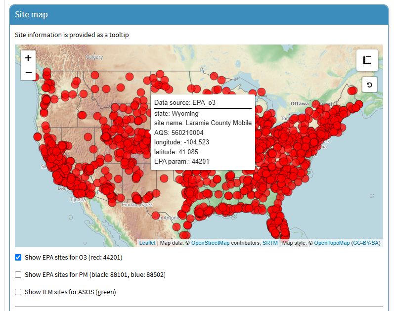

This tutorial is for the "PM2.5 and O3 smoke tool" app, available at ([https://westar.shinyapps.io/PMO3smokeTool/](https://westar.shinyapps.io/PMO3smokeTool/)).

The `[GAM manual]` tab is designed to provide users with comprehensive tools to manually manage data collection and loading processes for building GAMs. 
It includes two main sub-tabs: `[Data collection]` and `[Load dataset]`.
In this post, we introduce how to use `[Data collection]` sub-tab in `[GAM manual]` tab.
 

1. Go to `[GAM manual]` > `[Data collection]` tab.

  

2. There are three types of datasets to collect: PM2.5 & O3 data from the EPA, and ASOS (Automated Surface Observing Systems) meteorological data from the IEM (Iowa Environmental Mesonet). 
- <b>EPA sites for O3 (44210)</b>: Monitoring sites operated by the EPA that measure daily maximum 8-hour average ozone (MDA8) concentrations, categorized under parameter code 44210. 
The data is sourced from EPA-API.
If you want to download pre-generated file from EPA, 
please visit EPA website ([here](https://aqs.epa.gov/aqsweb/airdata/download_files.html){target="_blank"})
- <b>EPA sites for PM (88101, 88502)</b>: Monitoring sites managed by the EPA that measure particulate matter (PM2.5) concentrations, using parameter codes 88101 (FRM/FEM) and 88502 (non-FRM/FEM). 
The data is sourced from EPA-API.
If you want to download pre-generated file from EPA, 
please visit EPA website ([here](https://aqs.epa.gov/aqsweb/airdata/download_files.html){target="_blank"})
- <b>IEM sites for ASOS</b>: ASOS stations managed by the Iowa Environmental Mesonet (IEM), providing real-time meteorological data such as temperature, humidity, and wind speed. In addition, the data can be obtained using "riem" package in R
([here](https://cran.r-project.org/web/packages/riem/index.html){target="_blank"}).

  

3. Once you select (checkbox) the desired dataset, available sites will be displayed on a map.
If you want to find out information about a site, simply place your mouse cursor over the site.
You can then look at detailed site information including `state`, `site name`, `AQS code`, etc. 

  

4. You can also use the search feature to search by `state`, `site name`, or `AQS code`. 
This feature only applies to EPA AQS sites.

  

5. In this tutorial, we will use the Hawthorne site, UT as an example. 
When typing, you can also check the list below to see what data is available for collection at the Hawthorne site.
And then, when you click the `map icon`, the site location will be displayed on the map.

  

6. Let's click on the site (red-filled circle) on the map.
Then, the list of O3 monitoring site at this location will be added to the `[List of Selected Sites]` box.
In the same way, PM2.5 and ASOS sites can also be added.

  

7. To collect EPA data (excluding IEM-ASOS), you will need your email and an EPA API key.
If you do not have an EPA API key, enter your email in the box and click the `Get Key` button.
You should receive an email with your EPA API key within a few minutes.
If you want to know detailed instructions, please visit the EPA API official website ([here](https://aqs.epa.gov/aqsweb/documents/data_api.html#signup){target="_blank"}).

  

8. After entering your email and EPA API key, you will need to set your desired data collection period.
If you want to collect multi-year data but only for specific months, 
click on your desired months in the `Which months would you like to collect data for?` section.
Once everything is complete, click the `Run collection` button. The data collection process may take several minutes, 
depending on the period.

  

9. Once data collection is complete, the collected data will be displayed in the box below (`O3 data`, `PM2.5 data`, and/or `ASOS data`). If you want to download the collected data, you just click on `Save data` button for each data type.

  

10. When you click `Merge data`, collected data (O3, PM2.5, and/or ASOS) will be merged, and the detailed steps are as follows:
- For O3 and PM2.5 EPA data, if a site has multiple measurements, as indicated by the 'POC (Parameter Occurrence Code)' column, average all valid observations.
- The data priority is O3 > PM2.5 > ASOS, and when O3 data are available, the nearest PM2.5 and ASOS data based on the O3 measurement site will be merged.
- If O3 data are invalid or unavailable, the nearest ASOS data based on the PM2.5 measurement site will be merged.

  

11. If the data you collected includes PM2.5 data, the previously hidden `[HMS and PM2.5-Criteria]` tab will become visible.
This tab provides a tool for calculating PM2.5-criteria using `merged data`. 
For more details, please refer to our previous papers 
([Lee and Jaffe, 2024a](https://doi.org/10.1080/10962247.2023.2291197){target="_blank"};
[Lee and Jaffe, 2024b](https://doi.org/10.1021/acs.est.4c05870){target="_blank"}).
Once the options are set, click the `Run Process` button.
Then, the processed data, including the `HMS` and `PM2.5-criteria` columns, will be displayed in the box below.
If you want to download the data, click the `Save data` button.

  

So far, we have introduced the process of collecting PM2.5, O3, and meteorological data from EPA and IEM based on selected sites.
Now, you can use the collected data for further data analysis.

In the next post, we will explore how to perform GAM (Generalized Additive Model) analysis using the collected data.
