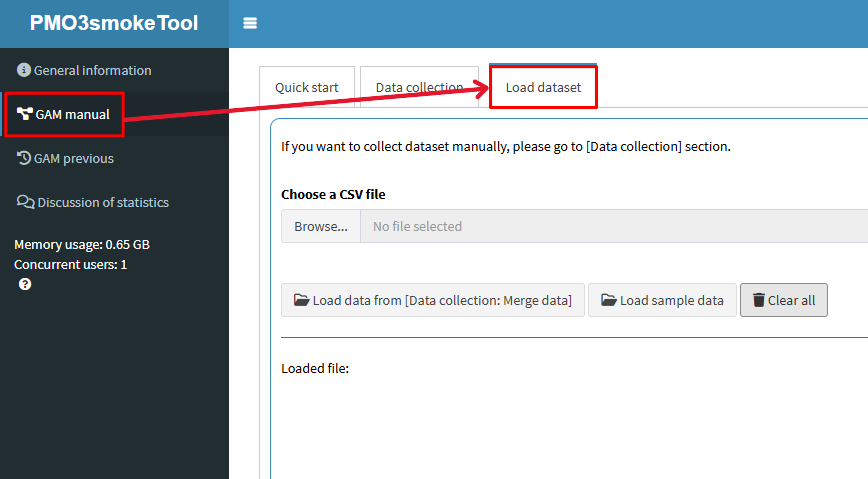
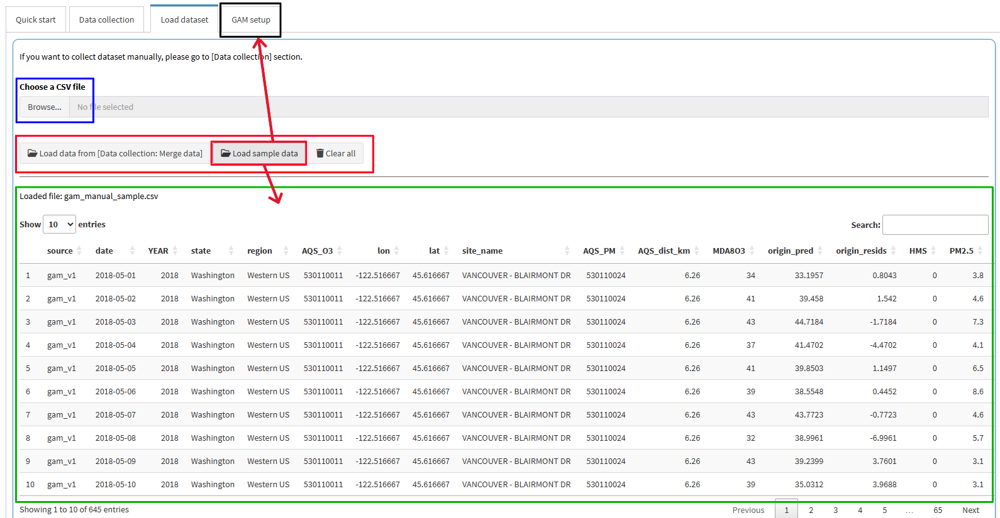
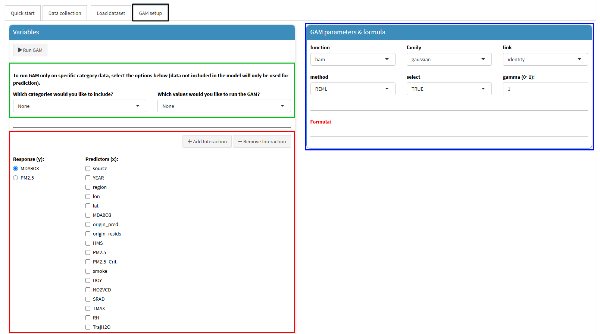
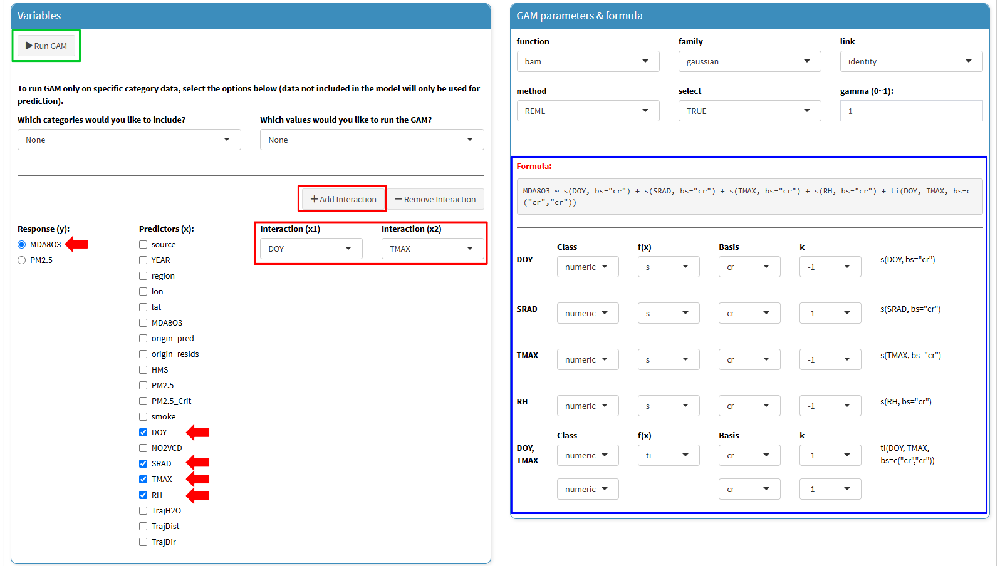
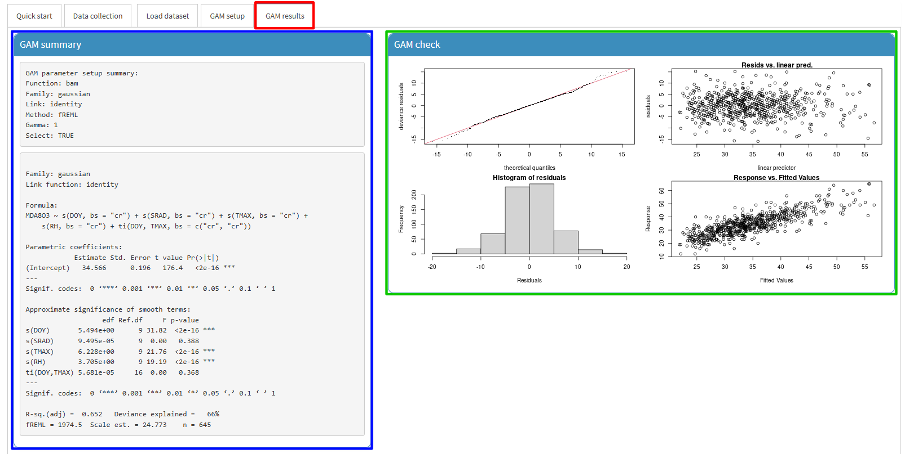

This tutorial is for the "PM2.5 and O3 smoke tool" app, available at ([https://westar.shinyapps.io/PMO3smokeTool/](https://westar.shinyapps.io/PMO3smokeTool/){target="_blank"}).

The `[GAM manual]` tab is designed to provide users with comprehensive tools to manually manage data collection and loading processes for building GAMs. 
It includes two main sub-tabs: `[Data collection]`, `[Load dataset]`, `[GAM setup]`, and `[GAM results]`.
Please note that `[GAM setup]` and `[GAM results]` are normally hidden unless you run `[Load datset]`.

In this post, we introduce how to use `[GAM setup]` sub-tab in `[GAM manual]` tab.
 

1. Go to `[GAM manual]` > `[Load dataset]` tab.

  

2. There are several buttons as given below: 

- `Browse...` (blue rectangle) : Used to import data prepared on your PC.
- `Load data from [Data collection: Merge data]` (in the red rectangle): Used to import data derived from `Merge data` in `[Data collection]` tab.
Please refer to the previous post `Smoke tool tutorial [01]: GAM manual - Data collection`.
- `Load sample data` (in the red rectangle): Used to import the sample data embedded in this app.
- `Clear all` (in the red rectangle): Used to clear the loaded data.

In this post, we will explain using the sample data. 
So, click the `Load sample data` button, then, the data will be displayed in the table below (green rectangle).
The sample data is from one of the sites analyzed in GAM v1.
This data includes various parameters such as meteorological data, MDA8 concentration, PM2.5 concentration, etc.

Note that when you import the data, `[GAM setup]` sub-tab is activated

(black rectangle).

  

3. Once you import the data, then, go to `[GAM setup]` sub-tab,
As you can see the below screenshot,  
`[GAM setup]` sub-tab consists of two parts, such as `Variables` and `GAM parameter & formula`.

- `Variables`: In this box, you can set up the response variable (y) and predictors (x) for GAM (red rectangle).
Additionally, if you want to train the GAM for a specific category, you can configure this option as shown in the green rectangle.
- `GAM parameter & formula` (blue rectangle): This box displays the GAM setup status based on your selections,
and allows you to control the GAM options and hyper-parameters such as `family`, `link`, `method`, etc. 
For more details, refer to the `mgcv` package 
([Wood, 2023](https://CRAN.R-project.org/package=mgcv){target="_blank"}).

  

4. Let's build a simple GAM to predict `MDA8O3` including an interaction smooth term. 

- Check the box for `MDA8O3` in the Response (y), and `DOY`, `SRAD`, `TMAX`, and `RH` as Predictors (x) (red arrows).
- Click the `Add interaction`, then set the variables as `DOY` (x1) and `TAMX` (x2) (red rectangle).  

As you set up the variables, the `GAM parameter & formula section` will dynamically display the corresponding equation in real time. Additionally, a panel will be provided for configuring detailed options for each smooth term. 

Note that this post does not provide a detailed explanation of these options. 
Therefore, it is recommended that you familiarize yourself with the `mgcv` package 
([Wood, 2023](https://CRAN.R-project.org/package=mgcv){target="_blank"})
before using them.

Once all settings are complete, click the `Run GAM` button (green rectangle).
Modeling begins the moment you click, and can take anywhere from a few seconds to a few minutes depending on the amount of data.

  

5. After running the GAM, the `GAM results` sub-tab will be activated (red rectangle).
This tab consists of several results including `GAM summary`, `GAM check`, `GAM smooth plots`, and `Data table` (results).

- `GAM summary` (blue rectangle): Displays a summary of the fitted GAM model, including coefficients, significance, and model statistics.
- `GAM check` (green rectangle): Provides diagnostic plots to assess the model’s assumptions and fit quality.
- `GAM smooth plots` (black rectangle): Visualizes the smooth functions estimated for each predictor in the model.
- `Data table`: Shows the finalized data used for model training and predictions including predicted values, residuals, etc. 
If you want to download the data, you just click the `Save data` button in the data table box.

  

  

So far, we have introduced how to build a GAM using a sample data in the `[GAM setup]` sub-tab.
The GAM provided in this app may be more limited compared to running it directly in R.
It is recommended to use it as a reference, while performing more extensive analyses directly in R.

In the next post, we will introduce how to explore and understand previously developed GAMs for O3 prediction and related air quality analyses in the `[GAM previous]` tab.