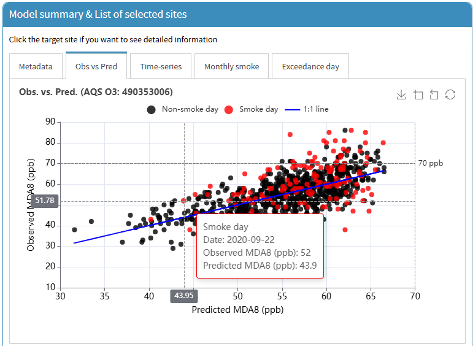
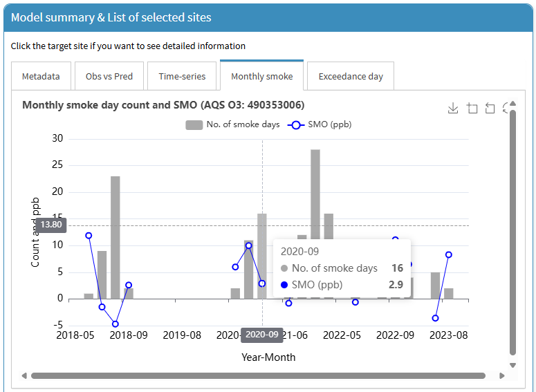
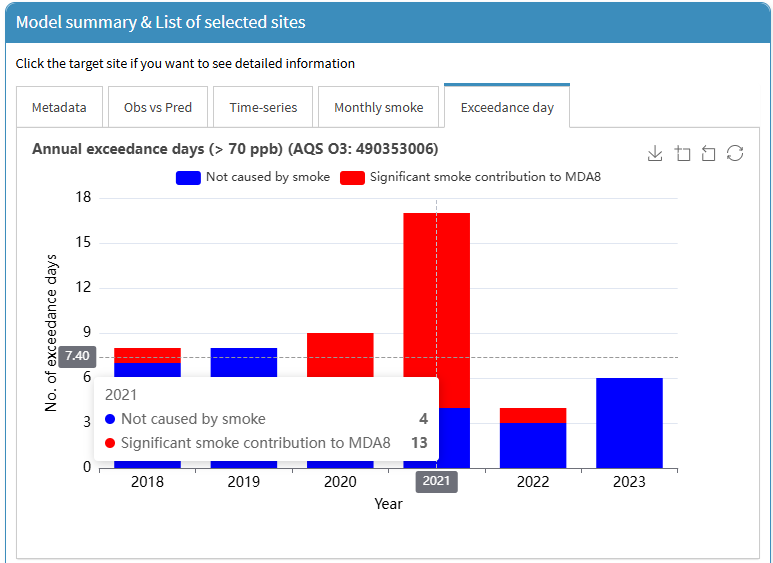

This tutorial is for the "PM2.5 and O3 smoke tool" app, available at ([https://westar.shinyapps.io/PMO3smokeTool/](https://westar.shinyapps.io/PMO3smokeTool/){target="_blank"}).

The `[GAM previous]` tab allows users to explore and understand previously developed GAMs for O3 prediction and related air quality analyses. It includes two main sub-tabs: `[Overview]` and `[Layer map]`.
Additionally, users can compare not only our GAM results but also findings from other studies on smoke contributions to O3 and PM2.5, derived using different methods.

In this post, we introduce how to use `[Overview]` sub-tab in `[GAM previous]` tab.
In the `[Overview]` sub-tab, users can view model metadata, compare different model outputs, 
and examine time-series and scatter plots of observed versus predicted values for selected sites.

1. Go to `[GAM previous]` > `[Overview]` tab.

  

2. The currently available datasets are as follows:

- `GAM v1` (red) : Research for smoke contribution to O3 using GAM in the US / data period: May to Sep, 2018-2023, study area: CONUS
([Lee and Jaffe, 2024](https://doi.org/10.1021/acs.est.4c05870){target="_blank"}).
- `GAM v3` (green) : Research for smoke contribution to O3 using GAM in the US / data period: Apr to Oct, 2019-2024, study area: CONUS + AK + HI
(not yet peer reviewed).
- `GAM v3 EDM` (darkgreen) : Research for smoke contribution to O3 using GAM in the US / data period: Apr to Oct, 2019-2024, study area: CONUS + AK + HI
(not yet peer reviewed).
- `EPA EMBER` (yellow) : Research for smoke contribution to O3 using EMBER in the US/ data period: Apr to Sep, 2023, study area: CONUS
([Simon et al., 2024](https://doi.org/10.1016/j.dib.2024.111208){target="_blank"}).
- `Smoke PM2.5` (magenta) : Research for smoke contribution to PM2.5 in the US / data period: Jan to Dec, 2019-2024, study area: CONUS + AK + HI
(not yet peer reviewed).

As demonstrated in `Smoke tool tutorial [01]: GAM manual - Data collection`, 
once you select (checkbox) the desired dataset, available sites will be displayed on a map.
If you want to find out information about a site, simply place your mouse cursor over the site.
You can then look at detailed site information including `state`, `site name`, `AQS code`, etc. 

  

3. You can also use the search feature to search by `state`, `site name`, or `AQS code`. 
In this tutorial, we will use the Hawthorne site, UT as an example. 
When typing, you can also check the list below to see what data is available for collection at the Hawthorne site.
And then, when you click the `map icon`, the site location will be displayed on the map.

  

4. Click on the site (red-filled circle) on the map. 
The `Metadata` for the selected site will then be displayed, 
and the site will be added to the `[Model summary & List of selected sites]` box. 
Similarly, additional sites from other results can be included in the list.
Note that if you want to remove a site from the list, 
click the `trash bin icon`.

  

5. In addition, you can also explore the results of target site as follows: 
- `[Obs vs pred]`: A scatter plot of `Observed` and `Predicted MDA8` for the `GAM v1`, `GAM v3`, `GAM v3 EDM`, and `EPA EMBER` data. 
In the `Smoke PM2.5` data, this plot is not supported.
- `[Time-series]`: A time-series plot of `Observed MDA8` and `Predicted MDA8` including `SMO` and `Smoke day` information   
 for the `GAM v1`, `GAM v3`, `GAM v3 EDM`, and `EPA EMBER` data.
 In the `Smoke PM2.5` data, only `Observed PM2.5` including `Smoke day` information is displayed. 
- `[Monthly smoke]`: Summary of monthly number of `smoke day` for all type of data.
- `[Exceedance day]`: Annual exceedance days (> 70 ppb) for the `GAM v1`, `GAM v3`, `GAM v3 EDM`, and `EPA EMBER`, 
and annual days with > 9 ug m-3 for the `Smoke PM2.5` data.

All plots have a download feature. 
If you want to download, click the `download icon` in the upper right corner in each plot.

  

  

  

  

6. Our app is providing the data download option for the `GAM v1`, `GAM v3`, `GAM v3 EDM`, `EPA EMBER`, and `Smoke PM2.5` data.
For the two datasets, `GAM v1` and `EPA EMBER`, already published 
([Lee and Jaffe, 2024](https://doi.org/10.1021/acs.est.4c05870){target="_blank"}; 
[Simon et al., 2024](https://doi.org/10.1016/j.dib.2024.111208){target="_blank"}), 
please note that they are also provided in the respective papers.
As mentioned in Step 5 above, after listing sites, you will need to set your desired data collection period (red rectangular).
Once the setting is complete, click the `Load data` button (blue rectangular). 
Or if you want to clear all site list, click the `Clear list` button (green rectangular).

  

7. Once data loading is complete, the data will be displayed in the box below (`GAM v1`, `GAM v3`, `GAM v3 EDM`, `EPA EMBER`, and/or `Smoke PM2.5`).
If you want to download the loaded data, you just click on the `Save data` button for each data section.

  

So far, we have introduced how to explore AQS sites in relation to previously developed GAMs for O3 prediction and related air quality analyses.
The `[Overview]` sub-tab allows users to compare different model outputs, and examine time-series and scatter plots of observed versus predicted values for selected sites.

In the next post, we will take a look at the `[Layer map]` sub-tab.

  &times;
  

