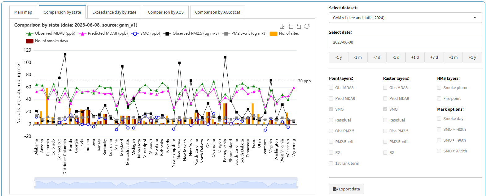
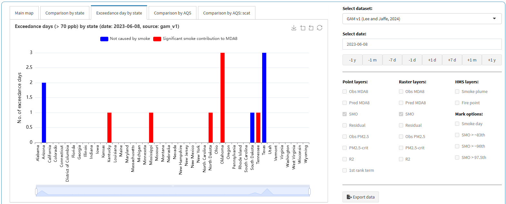
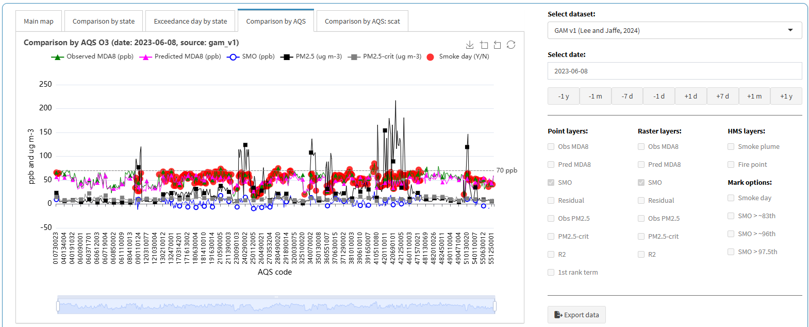
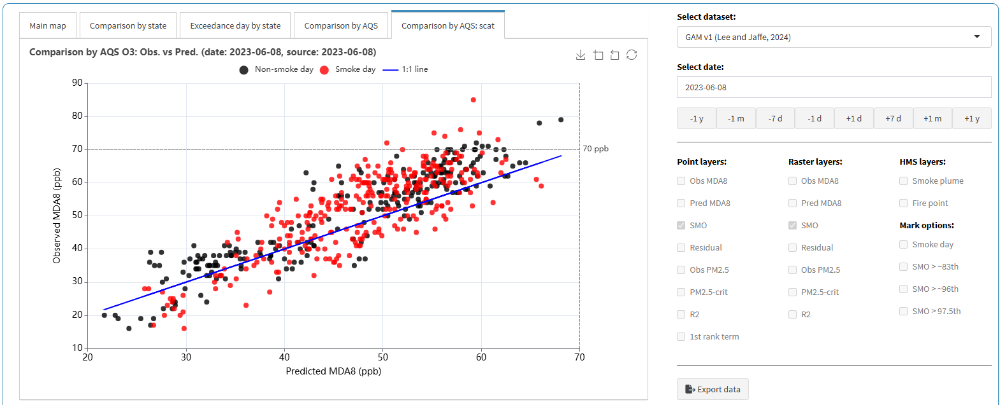

This tutorial is for the "PM2.5 and O3 smoke tool" app, available at ([https://westar.shinyapps.io/PMO3smokeTool/](https://westar.shinyapps.io/PMO3smokeTool/){target="_blank"}).

The `[GAM previous]` tab allows users to explore and understand previously developed GAMs for O3 prediction and related air quality analyses. It includes two main sub-tabs: `[Overview]` and `[Layer map]`.
Additionally, users can compare not only our GAM results but also findings from other studies on smoke contributions to O3 and PM2.5, derived using different methods.

In this post, we introduce how to use `[Layer map]` sub-tab in `[GAM previous]` tab.
In the `[Layer map]` sub-tab, users can load data for analysis and customize data visualization by choosing point, raster, or HMS layers. 
This functionality helps users assess the performance of various GAM models and compare different approaches to understanding air quality dynamics, particularly in the context of wildfires.

1. Go to `[GAM previous]` > `[Layer map]` tab.

  

2. `Layer map` configuration:

- `Pane (1)`: Displays the interactive map with air quality and smoke-related data.
  - Displays the interactive map with various layers related to air quality and smoke data.
  - Users can navigate, zoom, and search for specific locations.
  - The top tabs allow users to switch between different analysis plots:
    - `[Comparison by state]`
    - `[Exceedance day by state]`
    - `[Comparison by AQS sites]`
    - `[Comparison by AQS scatter plots]`
- `Pane (2)`: Allows users to choose datasets and adjust the analysis date.
  - Dataset Selection: Users can choose from different datasets, e.g., `GAM v1`, `GAM v3`, etc.
  - Date Selection: Users can select a specific date for analysis.
    - Predefined buttons allow quick shifts in dates (`-1y`, `-1m`, `-7d`, `+1d`, `+7d`, `+1m`, `+1y`).
- `Pane (3)`: Enables users to toggle different layers (point, raster, smoke data).
  - Users can toggle different layers to visualize specific data types.
  - Layer categories:
    - `Point layers`: Observed & predicted `MDA8 O3`, `PM2.5`, `SMO`, `Residuals`, `R2`, etc. 
    - `Raster layers`: Spatial interpolated versions of the point data.
    - `HMS layers`: Smoke plume and fire point data from NOAA-HMS.
    - `Mark options`: Special markers for smoke events and statistical thresholds.
- `Pane (4)`: Provides a button to download the displayed dataset for further use.
  - Provides an `Export data` button, allowing users to download the displayed dataset.
- `Pane (5)`: Parameter descriptions.
  - Lists detailed explanations of each variable used in the visualization. 
  - This descriptions vary depending on the dataset provided in Pane (2).

  

3. Let's setup configurations as follows (red arrows in Figure): 
- Select dataset: `GAM v1`
- Select date: `2023-06-08`
- Point layers: `SMO`
- Raster layers: `SMO`

Then, `point` and `raster` layer plots will be displayed on the interactive map. 
To view detailed information, simply hover your mouse over a site (green arrow).
The legend for the `point layer` is always displayed on the left,
while the legend for the `raster layer` is always displayed on the right (red rectangles).
To download data for the selected dataset (e.g., `GAM v1`) and date (e.g., `2023-06-08`), 
click the `Export data` button (blue rectangle).
For explanations of each parameter, refer to `Parameter descriptions` (green rectangle).

  

4. Depending on selected dataset and date, you can explore the results as follows: 
- `[Comparison by state]`: Comparison of `Observed MDA8`, `Predicted MDA8`, `Observed PM2.5`, and other parameters by state.
Since values are calculated by state, either the average or the sum is displayed.
- `[Exceedance day by state]`: Annual exceedance days (> 70 ppb) for the `GAM v1`, `GAM v3`, `GAM v3 EDM`, and `EPA EMBER`, 
and annual days with > 9 ug m-3 for the `Smoke PM2.5` data by state. 
- `[Comparison by AQS]`: Comparison of `Observed MDA8`, `Predicted MDA8`, `Observed PM2.5`, and other parameters by state.
Since values are calculated by AQS site.
- `[Comparison by AQS:scat]`: A scatter plot of `Observed` and `Predicted MDA8` for the `GAM v1`, `GAM v3`, `GAM v3 EDM`, and `EPA EMBER` data. In the `Smoke PM2.5` data, this plot is not supported.

All plots have a download feature. If you want to download, click the `download icon` in the upper right corner in each plot.

  

  

  

  

5. When switching to sub-tabs (red rectangles) `[Comparison by state]`, `[Exceedance day by state]`, `[Comparison by AQS]`, or `[Comparison by AQS:scat]`, `layers` options (blue rectangle) will be deactivated. 
Additionally, changing the dataset or date allows for immediate result comparison.

  

So far, we have introduced how to explore previously developed GAMs for O3 prediction and related air quality analyses spatially.
In the `[Layer Map]` sub-tab, users can load data for analysis and customize visualization by selecting point, raster, or HMS layers.
This functionality enables users to assess the performance of various GAM models and compare different approaches to understanding air quality dynamics, particularly in the context of wildfires.

All the tutorials are complete. Now explore our app!